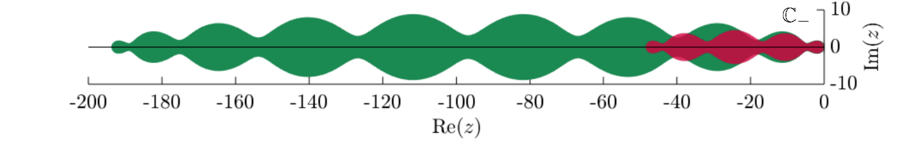

# mRKC
This code is a C++ implementation of several explicit stabilized methods for solving ordinary differential equations
$$y'=f(t,y),\qquad y(0)=y_0$$
and multirate ordinary differential equations
$$y'=f_F(t,y)+f_S(t,y),\qquad y(0)=y_0,$$
where $f_F$ is a stiff but cheap term and $f_S$ is a mildly stiff but expensive term.

In addition to the explicit stabilized methods listed below, standard methods such as explicit and implicit Euler, explicit and implicit midpoint, and Runge-Kutta 4 are implemented for comparison purposes.

## Explicit stabilized methods
Explicit stabilized methods use an increased number of stages to increase stability, in contrast to standard methods that use more stages to increase accuracy. Due to this different strategy, the stability domain grows quadratically along the negative real axis and the methods have no step size restriction (despite being explicit). For instance, see below the stability domain of the RKC method for $10$ (green) and $5$ (red) function evaluations. As a comparison, the stability domain of explicit Euler with 10 function evaluations would cover the $[-20,0]$ interval only.

<p align="center">
  
</p>

In this code we implement the following explicit stabilized methods: [RKC](https://doi.org/10.1016/S0377-0427(97)00219-7), [ROCK](https://doi.org/10.1007/s002110100292), [RKL](https://doi.org/10.1016/j.jcp.2013.08.021), RKU[^RKU] for the non multirate problem $y'=f(y)$.

## Multirate explicit stabilized methods
When solving a multirate equation $y'=f_F(y)+f_S(y)$ with an explicit stabilized method as RKC, the two terms $f_F,f_S$ are evaluated together. Therefore, the number of function evaluations might depend on the severe stiffness of very few terms in $f_F$. This destroys efficiency since the expensive term $f_S$ is evaluated as many times as $f_F$. Hence, the evaluation of $f_F$ and $f_S$ must be decoupled.

### Modified equation
Instead of solving the original multirate problem
$$y'=f_F(y)+f_S(y),$$
the multirate explicit stabilized methods, as mRKC, solve a modified equation
$$y_\eta'=f_\eta(y_\eta),\qquad y_\eta(0)=y_0,$$
with an explicit stabilized method, as RKC in this case. The advantage is that the modified equation is such that the stiffness of $f_\eta$ depends on the slow terms $f_S$ only, and therefore solving  $y_\eta'=f_\eta(y_\eta)$ is cheaper than $y'=f_F(y)+f_S(y)$. Moreover, evaluating $f_\eta$ has a similar cost as $f_F+f_S$.

### The auxiliary problem
The averaged right-hand side $f_\eta(y_\eta)$ is defined by solving an auxiliary problem
$$u'=f_F(u)+f_S(y_\eta) \quad t\in (0,\eta), \quad u(0)=y_\eta,\qquad f_\eta(y_\eta)=\tfrac{1}{\eta}(u(\eta)-y_\eta).$$
Since the expensive term $f_S$ is frozen, solving the auxiliary problem is comparable to evaluating $f_F+f_S$. The value of $\eta>0$ depends on the stiffness of $f_S$ and in general satisfies $\eta\ll\Delta t$, with $\Delta t$ the step size used to solve the modified equation $y_\eta'=f_\eta(y_\eta)$. The auxiliary problem is solved as well using an explicit stabilized method, in this case, RKC.

## References
For more details on the mathematical background and for numerical results produced with this code, see the following publication:
>Abdulle, A., Grote, M. J., & Rosilho de Souza, G. (2022). _Explicit stabilized multirate method for stiff differential equations_. Mathematics of Computation, 91(338), 2681–2714, [DOI:10.1090/mcom/3753](http://dx.doi.org/10.1090/mcom/3753).


## Install and Run
One possible way to run the code is by creating a Docker image from the Dockerfile provided here and running the code within a container. Otherwise, one could compile the code as usual.

### Docker
To create the Docker image, from the root directory of the repository, run:
> docker build -t multirate .  

For running the code, execute:
> docker run --rm -ti -v "$(pwd)/results":/multirate/results multirate ARGS_LIST

For the `ARGS_LIST`, see below.

### Compile
For compilation, [eigen](https://eigen.tuxfamily.org/index.php?title=Main_Page) is needed. However, if the code has been downloaded with `git clone ...`, then a compatible version of `eigen` is cloned automatically by the makefile[^eigen]. Hence, the following command will download the dependency and compile the code:

> mkdir build && cd build && cmake -S .. -B . && make

Run the code from the ``build`` directory as
> ./MultirateIntegrators ARGS_LIST

For the `ARGS_LIST`, see the next section.

### Command line arguments
For the full list of arguments use the `--help` option or check out the [`ARGS_LIST.md`](ARGS_LIST.md) file, here we just provide an example.

To run a simulation  

- solving the PDE Brusselator benchmark (problem 5): `-test 5`,
- with the mRKC method and step size $\Delta t=0.01$: `-rk mRKC -dt 1e-2`,
- with output in `.bin` format every 10 time steps: `-bin true -ofreq 10`,

in the `build` directory execute:

```
./MultirateIntegrators -test 5 -rk mRKC -dt 1e-2 -bin true -ofreq 10
```

The output is stored in the `results` folder.

### Visualization

For visualization of the results, several Matlab scripts are provided in the `matlab` folder. To produce output with the appropriate format use either the `-matlab true` or `-bin true` arguments.


[^RKU]: Unpublished.

[^eigen]: If the code has been downloaded as a zip, then you should manually place a compatible version of eigen (e.g. 3.4.1) in the `/external/eigen`folder.

